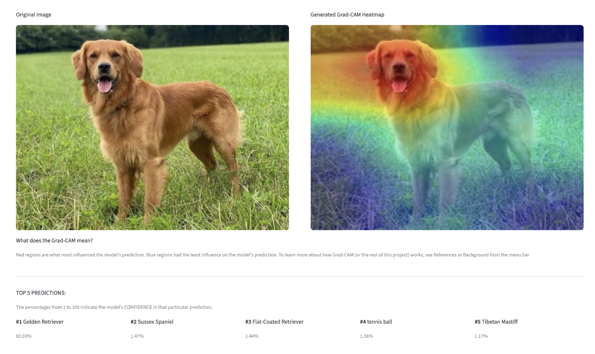
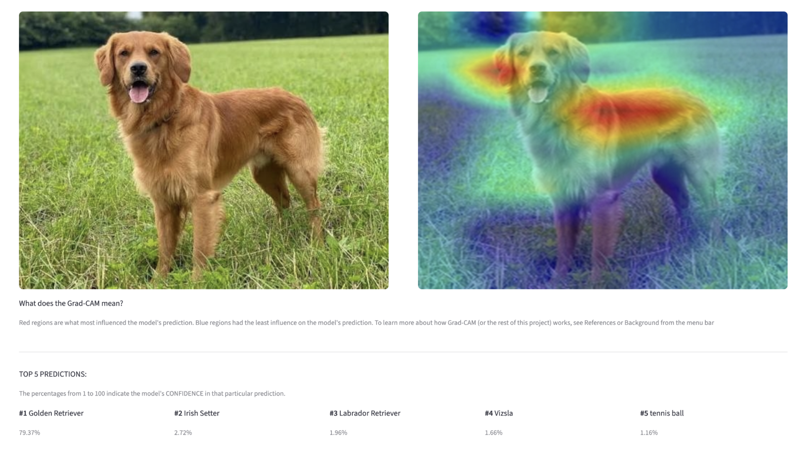
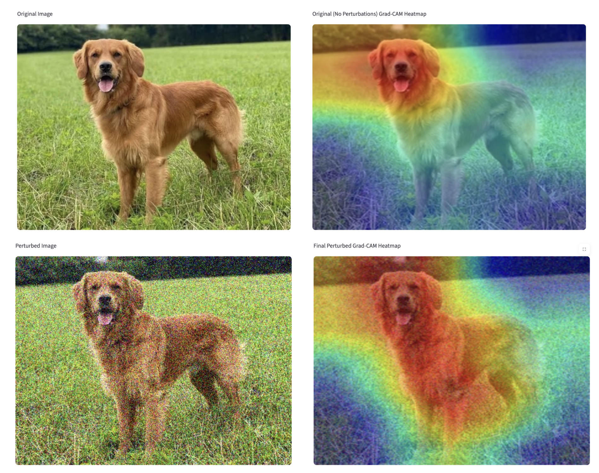
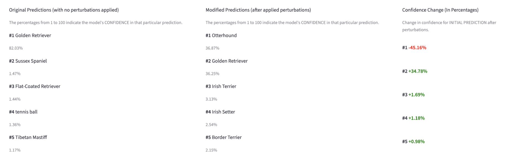
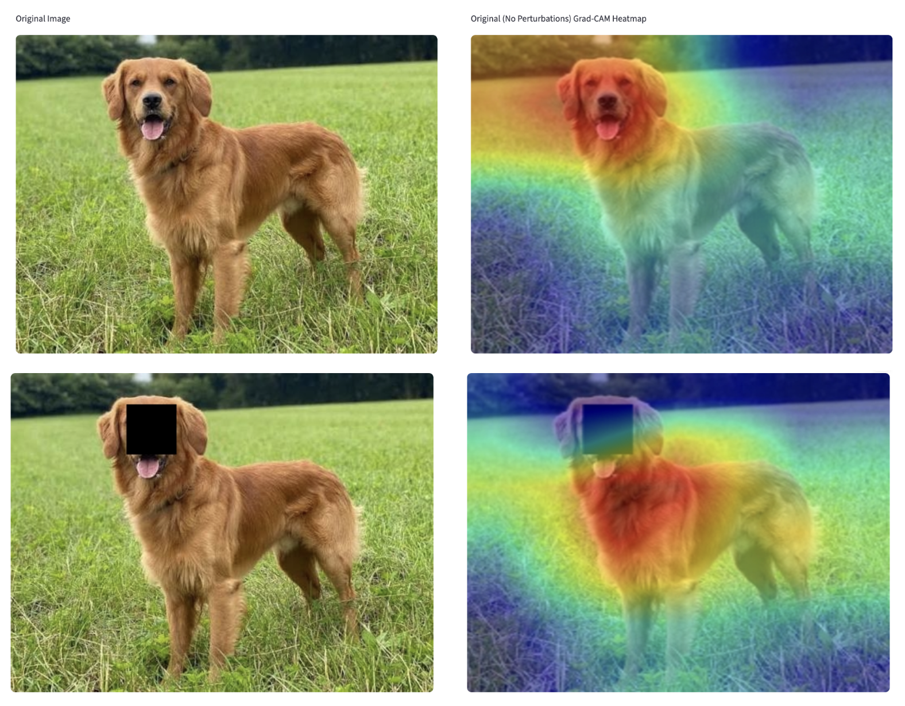
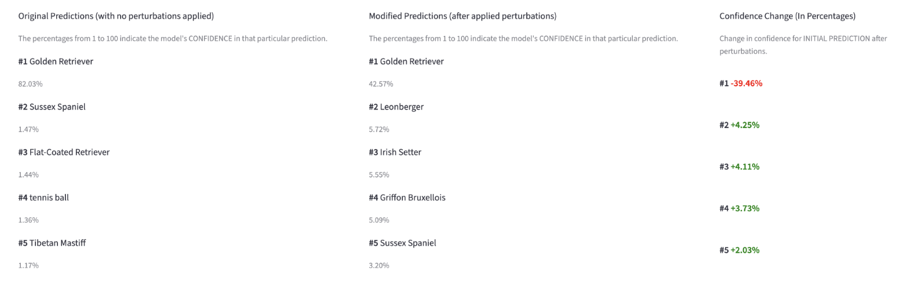
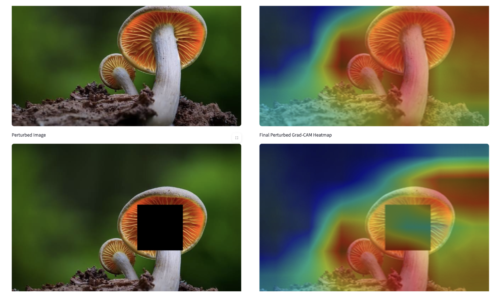
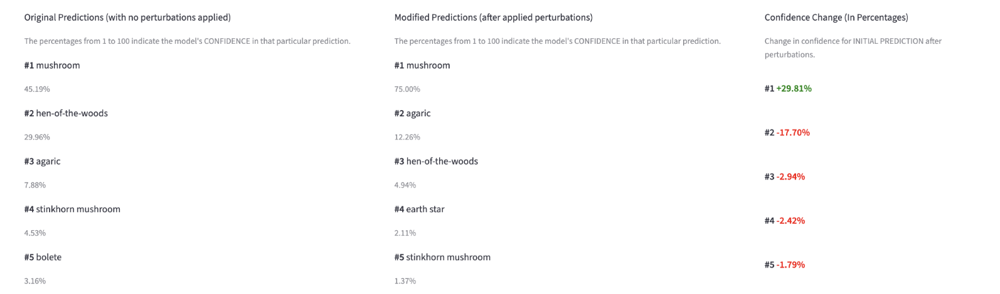

# Interactive CNN Visualizer

An interactive Streamlit application for exploring CNN interpretability and robustness using Grad-CAM visualizations and image perturbations.

Live at: **[https://interactive-cnn-visualizer.streamlit.app](https://interactive-cnn-visualizer.streamlit.app)**

## Project Overview

This project is an interactive platform for exploring how convolutional neural networks (CNNs) make image-classification decisions and how robust those decisions are under varied conditions. 

Users can upload an image or select from a list of curated examples, choose a CNN model architecture, and generate a Grad-CAM (Gradient-weighted Class Activation Mapping) heatmap. This heatmap highlights the regions of an image that most influenced the model's predictions (which are also displayed). 
Additionally, users can apply and control various image perturbations (mirroring real-world noise) of their choice to the image. Afterwards, users can compare the resulting heatmaps and model predictions/confidence drops side-by-side. 

This application was built with the goal of exploration, largely due to the wide array of possibilities and factors to vary, including unique input images, differing model architectures, and varying image perturbations. 

Therefore, due to its accessibility, the project is aimed at anyone curious about explainable AI. It requires no machine learning background to use, while still offering sufficient depth for users with substantial machine learning experience. 

## Features

- Interactive Streamlit interface
- Upload custom images OR choose from a curated collection of example images
- Choose a CNN architecture for the trial
- Optional controls on Gaussian noise, image rotations, and/or black rectangular image occlusions to test robustness and simulate real-world corruption
-  Grad-CAM (Gradient-weighted Class Activation Mapping) visualization, with a side-by-side comparison of original and perturbed results  
- Side-by-side list of original and perturbed predictions, with per-rank confidence drops displayed to indicate model sensitivity
- View "How to Use" instructions and a detailed "Background, References, and Tools Used" section in the app 

## Demo

This is a short demo to showcase the functionality of this application. We will start this demo with basic tests of a basic image on two basic model architectures, before testing different image perturbations and consequently discovering some interesting model attention patterns. 

Let's begin with a simple image of a golden retriever, and let's use the ResNet-50 CNN to begin (see the Supported Architectures section). We run the first trial with no added perturbations and obtain the following Grad-CAM heatmap, with the top 5 predictions of the model displayed below (for this demo, we will display the top 5 predictions, although this can be changed in-app if desired.) 

Remember, warmer regions of the heatmap are more influential for the decision.



ResNet-50 correctly identifies the golden retriever, with 82% confidence. The Grad-CAM heatmap shows that the model's attention concentrated on the dog's head and face, indicating that these regions were the most influential for this prediction. 

----
Before we add complexity, we now test run the same trial but using the VGG-16 architecture:



VGG-16 also correctly predicts golden retriever (79% confidence). However, the main attention pattern shown by the Grad-CAM heatmap is completely different. The heatmap for VGG-16 shifts away from the dog's face and instead onto texture-based features such as the dog's back and coat.

----
Now, let's switch back to the ResNet-50 CNN. We now apply Gaussian Noise of a chosen strength 65 (out of 100) to the image, distorting each pixel. 

For the rest of the trials, the results above show a 2x2 grid. The top row consists of the original image (left) and perturbed image (right). The bottom row is what to focus on, as it consists of the original, no-perturbation Grad-CAM heatmap (left) next to the Grad-CAM heatmap after adding perturbations (right). Below, two prediction lists are shown (the original predictions on the left and the perturbed predictions on the right), including a confidence change column indicating the change in the model's confidence for each original prediction.



<br/>



With significant noise applied, the model's confidence for the golden retriever prediction drops by a substantial 45%. The heatmap becomes more scattered, as the model relies less on solely the face and more on the entire dog's body. While the model still attends to the dog, it does so with less certainty and less focus on a specific region. After applying the perturbation, the model misclassifies the golden retriever as an otterhound. 

----
It is evident that the dog's face is perhaps the most influential region of the image for the model's prediction. Instead of using Gaussian Noise, let's instead occlude a 60 px region of the image containing most of the dog's face and see how our model adapts.



<br/>



Blocking the face causes a significant confidence drop by almost 40%, confirming that the face region was driving the prediction. With the face occluded, we see the heatmap shift to the rest of the dog's body, especially the dog's fur. The model was able to adapt to the point where it retained its correct prediction of the golden retriever over other similar dog breeds. 

----
What if we instead choose a different image, where occluding a central feature of that image could make a more significant difference? Let's try using an image of a mushroom instead, and let's apply a large 130 px occlusion centered on the main cap of the mushroom.



<br/>



We may expect occluding the center of the mushroom to significantly decrease model confidence. However, model confidence counterintuitively increases from 45% to 75%! This reveals that stem features (which we occluded) may have been originally competing with other features of the mushroom, instead of supporting the prediction (an example of feature interference). The differences in the pre-occlusion and post-occlusion Grad-CAM heatmaps reveal that occluding these features allowed the model to focus more cleanly on the mushroom's orange cap without the full unoccluded image introducing noise into the decision.

## Supported Architectures 

- ResNet-50: CNN baseline for this project using residual (skip) connections
- VGG-16: Classical, sequential CNN composed primarily of stacked convolutional layers
- EfficientNet-B0: Parameter-efficient CNN that balances network depth, width, and input resolution
    
More detail and background on how the architectures differ and why they were chosen can be found in the in-app section "Background, References, and Tools Used".

## Supported Perturbations

- Gaussian Noise: tests robustness to random corruption (of user-specified degree) within image pixels
- Rotation: rotates image (user-specified) to test viewpoint sensitivity
- Occlusion: blacks out a rectangular user-specified image region, tests model dependence on certain regions

Perturbations can be applied individually or stacked in any combination.

## Ideas for Exploration

1. Different model architectures may focus on different image regions for the same input image
2. Different model architectures may be the most sensitive to certain types of image perturbations.
3. Image perturbations may be the most severe for certain images. Try images with ambiguous or partially occluded objects, there might be interesting attention patterns.
4. Incorrect predictions and/or huge confidence drops may correspond to especially insightful heatmap comparisons
5. Texture-heavy images may reveal whether CNN models rely heavily on texture-related features
6. Applying occlusion directly over warm (influential) regions in the Grad-CAM heatmap may be an important test
7. Try the same image and different noise levels to find thresholds for where predictions break down

## Using the App

The app is live at: **[https://interactive-cnn-visualizer.streamlit.app](https://interactive-cnn-visualizer.streamlit.app)**
Simply open the link in your browser.

If you would like to run the app locally:

1. Clone the repository
\```bash
git clone https://github.com/AarushArya1/interactive-cnn-visualizer.git
cd interactive-cnn-visualizer
\```

2. Install required dependencies
\```bash
pip install -r requirements.txt
\```

3. To run the app:
\```bash
python -m streamlit run app.py
\```

A localhost link will open.

## Project Structure
```
interactive-cnn-visualizer/
│
├── app.py                      # Main Streamlit application, run this
│
├── model_ResNet50.py           # ResNet-50 model loading, preprocessing, prediction
├── model_VGG16.py              # VGG-16 model loading, preprocessing, prediction
├── model_EfficientNetB0.py     # EfficientNet-B0 model loading, preprocessing, prediction
│
├── gradcam.py                  # Grad-CAM heatmap generation and overlay onto image
├── perturbations.py            # Gaussian noise, rotation, and occlusion code
│
├── instructions.md             # In-app "How to Use" text
├── background_references.md    # In-app "Background, References, & Tools Used" text
│
├── examples/                   # Curated example images for in-app selection, consists of 27 images
│
├── demo/                       # Stores the images used in the "Demo" section of this README.md
├── requirements.txt            # Python dependencies
└── runtime.txt                 # Python runtime version for Streamlit Community Cloud

Note: The `prototype/` folder contains early-stage command line testing files from the first version of the project. It is outdated and is not a part of the main application. 

```
## Tools Used

- PyTorch — The main deep learning framework used to load pretrained models (using Torchvision), run forward and backward passes for the CNNs, compute gradients for Grad-CAM
- Torchvision — Used to load pretrained ResNet-50, VGG-16, and EfficientNet-B0 models and apply standard ImageNet preprocessing transforms
- Streamlit — Used to build the front-end of the project, the interactive web application (including image upload, model selection, perturbation controls, results display, and informational sections)
- Pillow (PIL) — Used for all image operations: opening, converting, resizing, manipulating
- NumPy — Used for array operations when computing heatmaps or working with images
- OpenCV (cv2) — Used to apply the colormap COLORMAP_JET and blend the heatmap with the original image
- Python datetime & os modules — Used for generating timestamped output filenames in order to manage file paths across the project

## References

1. [Grad-CAM: Visual Explanations from Deep Networks via Gradient-based Localization](https://doi.org/10.1109/ICCV.2017.74)  
   Selvaraju, R. R., Cogswell, M., Das, A., Vedantam, R., Parikh, D., & Batra, D. (2017). *Proceedings of the IEEE International Conference on Computer Vision (ICCV)*, 618–626.

2. [Deep Residual Learning for Image Recognition](https://doi.org/10.1109/CVPR.2016.90)  
   He, K., Zhang, X., Ren, S., & Sun, J. (2016). *Proceedings of the IEEE Conference on Computer Vision and Pattern Recognition (CVPR)*, 770–778.

3. [Very Deep Convolutional Networks for Large-Scale Image Recognition](https://arxiv.org/abs/1409.1556)  
   Simonyan, K., & Zisserman, A. (2015). *International Conference on Learning Representations (ICLR).*

4. [EfficientNet: Rethinking Model Scaling for Convolutional Neural Networks](https://arxiv.org/abs/1905.11946)  
   Tan, M., & Le, Q. V. (2019). *Proceedings of the 36th International Conference on Machine Learning (ICML).*

5. [ImageNet: A Large-Scale Hierarchical Image Database](https://doi.org/10.1109/CVPR.2009.5206848)  
   Deng, J., Dong, W., Socher, R., Li, L.-J., Li, K., & Fei-Fei, L. (2009). *Proceedings of the IEEE Conference on Computer Vision and Pattern Recognition (CVPR)*, 248–255.

6. [PyTorch: An Imperative Style, High-Performance Deep Learning Library](https://arxiv.org/abs/1912.01703)  
   Paszke, A., Gross, S., Massa, F., et al. (2019). *Advances in Neural Information Processing Systems (NeurIPS), 32.*

## Future Directions for this project

- Integrating a Vision Transformer (ViT) model for comparison to CNNs
- Experiment history and result logging
- Exportable results
- Auto-generated observations (as objective as possible) based on Grad-CAM comparisons and prediction/confidence changes

## Learn More

- See "Background, References, & Tools Used" in the app for a brief guide on concepts such as Grad-CAM or CNN architectures 
- For more comprehensive usage instructions, see "How to Use" in the app
- See referenced papers for further research


